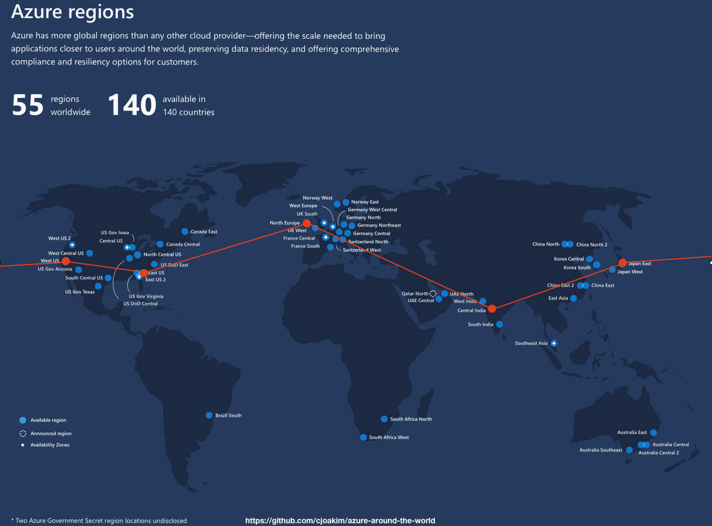

# azure-around-the-world

**Around the World** on Azure, with the **Azure Kubernetes Service (AKS)**

---



---

# Application Functionality

- HTTP POST a **Journey** JSON object to one Azure Region
  - The JSON object describes the endpoints of the **HTTP journey to be taken around the world**
  - The JSON is HTTP POSTed, and **aggregated**, from points A to B to C to D to E to A 
  - The endpoints are this same **AKS** web service application, deployed to multiple regions (see regions below)
  - The JSON Journey document is persisted to **CosmosDB** once the journey has traversed the planet
  - The **starting point is the endpoint** of the Journey, to guarantee accurate timing 
- The Journey documents in **CosmosDB** can be read from a web service endpoint
- Kubernetes HTTP **health** and **alive** endpoints are implemented, and include the container build date

---

# Implementation Highlights

- A [Java & Spring Boot](https://spring.io/projects/spring-boot) HTTP web service application
- Compiled and Packaged as a **JAR** file with [Apache Maven](https://maven.apache.org)
- Containerized with [Docker](https://www.docker.com)
- Uses [CosmosDB](https://docs.microsoft.com/en-us/azure/cosmos-db/introduction) and the [CosmosDB Async SDK for Java](https://docs.microsoft.com/en-us/azure/cosmos-db/sql-api-sdk-async-java)
- Uses [Bash]() and [Azure CLI](https://docs.microsoft.com/en-us/cli/azure/install-azure-cli?view=azure-cli-latest) scripts to provision resources
- Tested locally with [Docker Compose](https://docs.docker.com/compose/)
- Uses an [Azure DevOps](https://azure.microsoft.com/en-us/services/devops/) Pipeline to build the Docker container
- Uses [Azure Container Registry](https://azure.microsoft.com/en-us/services/container-registry/)
- Uses the [kubectl](https://kubernetes.io/docs/reference/kubectl/overview/) Kubernetes CLI program to deploy and query the **AKS** clusters
- Uses the [Kubernetes YAML Files](https://kubernetes.io/docs/reference/generated/kubernetes-api/v1.18/) to describe the cluster objects
- The app is deployed to five [Azure Regions](https://azure.microsoft.com/en-us/global-infrastructure/regions/): **eastus, westeurope, centralindia, japaneast, westus, eastus**
- Most of the shell scripts and YAML files are generated with [Python 3](https://www.python.org) and [Jinga2 Templates](https://jinja.palletsprojects.com/en/2.11.x/) templates
- Python and the [requests](https://requests.readthedocs.io/en/master/) library is used as the HTTP client program
- **Environment Variables** are used extensively, both at runtime and in development, per the [The Twelve-Factor App](https://12factor.net)

## Room for Improvement

- [Kubernetes Namespaces](https://kubernetes.io/docs/tasks/administer-cluster/namespaces-walkthrough/)
- [Kubernetes Secrets](https://kubernetes.io/docs/concepts/configuration/secret/)

---

## Demonstrate the Application

### POST a Journey from the Command-Line

### [Sample POSTed Journey Object](sample_journey_spec.md)

### [Sample Completed Journey Document](sample_journey_completed.md)

### Query CosmosDB for the completed Journeys

```
SELECT c.pk, c.elapsedMs FROM c order by c.elapsedMs 

SELECT * FROM c order by c.elapsedMs OFFSET 0 LIMIT 3
```

---

## [Compile and Test Locally](compile_test.md)

## [Automated File Generation With Python](python_automation.md)

## [Command-Line Provisioning and Deployment](command_line_provisioning_and_deployment.md)

## [Azure DevOps Pipeline](devops_pipeline.md)

## [Interact with your clusters with kubectl](kubectl.md)
